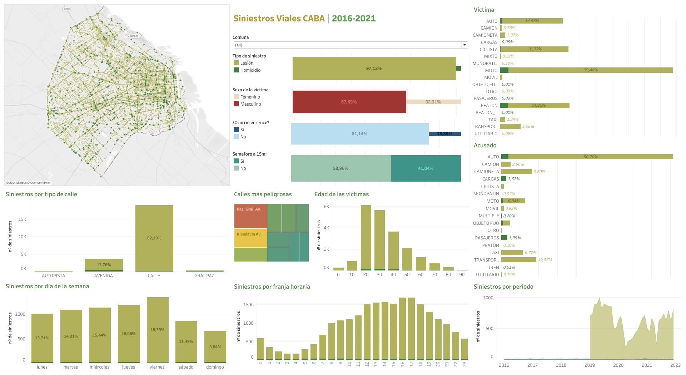
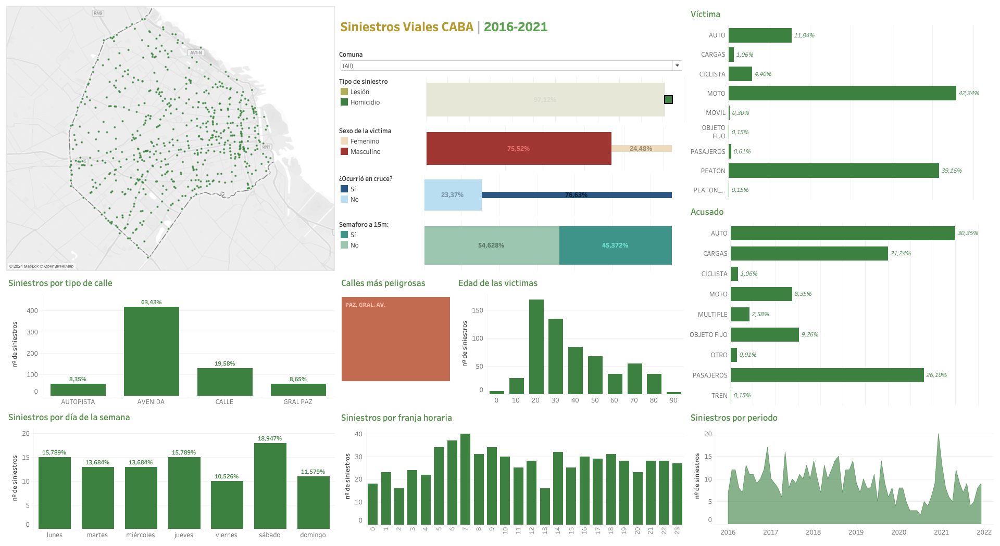
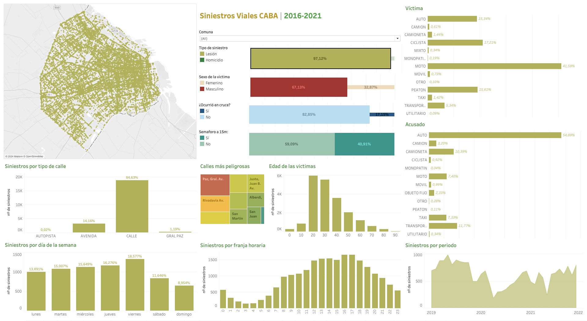
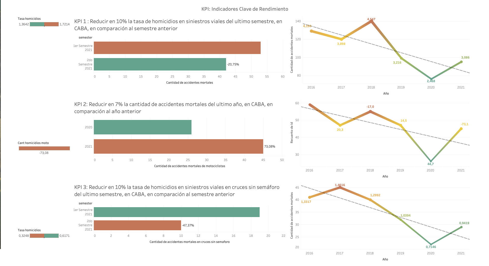

# Homicidios y lesiones por siniestros viales en la Ciudad Autónoma de Buenos Aires, Argentina.  

## Introducción

Este proyecto simula el rol de un analista de datos trabajando en un estudio para el **Observatorios de Movilidad y Seguridad Vial (OMSV)**. El estudio pretende generar nueva información que permita a las autoridades locales tomar medidas para disminuir el numero de victimas, fatales o no, de siniestros viales ocurridos en CABA. Para ello, se utilizan los datos de [Siniestros Viales](https://data.buenosaires.gob.ar/dataset/victimas-siniestros-viales), disponibles e el portal Buenos Aires Data. Los datos proporcionados contienen informacion recolectada en el periodo 2016-2021 para Homicidios, y 2019-2021 para Lesiones. 

Como producto final, se espera un tablero interactivo que facilite la intepretación y análisis de la información, acompañado de reporte de las tareas realizadas, las metodologias adoptadas y las principales conclusiones obtenidas.

## Contexto
Los siniestros viales, también denominados incidentes de tráfico, siniestros viales o accidentes de tránsito, representan situaciones donde vehículos se ven involucrados en espacios públicos. Estos eventos pueden ser desencadenados por diversas causas, como colisiones entre automóviles, motocicletas, bicicletas o peatones, atropellos, impactos contra objetos fijos o incluso caídas de vehículos. Las consecuencias abarcan desde daños materiales hasta lesiones graves o, lamentablemente, pérdidas fatales para los afectados. Los siniestros viales son una preocupación importante en la Ciudad Autónoma de Buenos Aires debido al alto volumen de tráfico y la densidad poblacional. 

## Datos 

Este proyecto trabajó con la base de datos **Siniestros Viales**, la cual contiene dos archivos Excel:  
* **Homicidios** : Información sobre homicidios en siniestros viales ocurridos en la Ciudad desde el año 2016 hasta el 2021. Los datos incluyen fecha y ubicación del hecho y tipo de transporte involucrado.

* **Lesiones** : Información sobre las lesiones en siniestros viales ocurridos en la Ciudad desde el año 2019 hasta el 2021. Los datos incluyen fecha y ubicación del hecho y tipo de transporte involucrado.

Cada archivo contiene dos pestañas: 
* **HECHOS**: que contiene una fila de hecho con id único y las variables temporales, espaciales y participantes asociadas al mismo.
* **VICTIMAS**: contiene una fila por cada víctima de los hechos y las variables edad, sexo y modo de desplazamiento asociadas a cada víctima. Se vincula a los HECHOS mediante el id del hecho.

## Tecnologías utilizadas

- **Python y Pandas** para la extración, carga y transformación de los datos. También se aprovechó la librería **GeoPy** para incorporar nueva información sobre cercanía de los siniestros a semáforos: [ETL](/notebooks/01_ETL.ipynb)
- **Numpy, Pandas, Matplotlib y Seaborn** para el Análisis Exploratorio de Datos: [EDA](/notebooks/02_EDA.ipynb)
- **Tableau**, para la creación del [tablero interactivo](/Tablero_siniestros_viales_CABA.twb)

## ETL y EDA 

En primer lugar, se realizó un proceso de extracción, transformación y carga de los datos (ETL), tanto de "HECHOS" como "VÍCTIMAS" en datasets Homicidios y Lesiones, donde se estandarizaron nombres de las variables, se analizaron nulos y duplicados de los registros, se eliminaron columnas redundantes o con muchos valores faltantes, entre otras tareas específicas como:
- Eliminar o reemplazar valores 'SD' en distintas columnas.
- Eliminar filas con valores atipicos como '.', 'SD' en columnas Latitud y Longitud, ya que no permiten el mapeo de los hechos.
- Transformar la columna 'Cruce' a booleano, para indicar unicamente si el siniestro ocurrió en un cruce o no. 

Una vez procesados los 4 dataset originales: homicidios_hechos, homicidios_victimas, lesiones_hechos, lesiones_victimas, se procede a concatenarlos en dos datasets: **siniestros_hechos** y **siniestros_victimas** los cuales se relacionan a través de las columnas 'Id' e 'Id_Hecho', respectivamente. 

A siniestros_hechos se agregan las siguientes columnas:
-  **Dataset** : indica si el siniestro es homicidio o lesion
- **semaforo_15m** : indica si el siniestro ocurrió o no dentro de un radio de 15 metros de un semáforo. 

- **semaforo_30m** : indica si el siniestro ocurrió o no dentro de un radio de 30 metros de un semáforo. 

Posteriormente, se procedió a realizar un análisis exploratorio exahustivo (EDA), con la finalidad de encontrar patrones que permitan generar información que le permita a las autoridades locales tomar medidas para disminuir la cantidad de víctimas fatales de los siniestros viales. Todos los detalles de este análisis se encuentran [aquí](/notebooks/02_EDA.ipynb).

## Análisis de Datos
#### Siniestros viales, visión general

-   Observaciones:
    * El 82% de los siniestros ocurren en vias de tipo calle
    * La mayoría de las víctimas tiene entre 20 y 39 años
    * Los siniestros viales tienden a ocurrir en la tarde y en dia viernes
    * Los particpantes más comunes son: Moto como víctima y Auto como acusado. 
    * El 67% de las victimas son  varones
    * Tan solo el 18% de los siniestros ocurrió en un cruce
    * El 40% ocurrió en un semáforo. 
#### Siniestros viales: Homicidios

-   Observaciones:
    * El 63% de los homicidios ocurren en vias de tipo avenida
    * La mayoría de las víctimas tiene entre 20 y 39 años
    * Los accidentes mortales tienden a ocurrir entre las 6 y las 7:59 de la mañana y en fin de semana
    * Los particpantes más comunes son: Moto como víctima y Auto como acusado. 
    * El 72% de las victimas mortales son varones
    * El 77% ocurrió en un cruce
    * El 45% ocurrió en un semáforo. 
#### Siniestros viales: Lesiones

-   Observaciones:
    * El 84% de los siniestros ocurren en vias de tipo calle
    * La mayoría de las víctimas tiene entre 20 y 39 años
    * Los siniestros viales tienden a ocurrir en la tarde y en dia viernes
    * Los particpantes más comunes son: Moto como víctima y Auto como acusado. 
    * El 67% de las victimas son varones
    * Tan solo el 18% de los siniestros ocurrió en un cruce
    * El 40% ocurrió en un semáforo. 

## Indicadores Clave de Rendimiento (KPI)

En función de lo analizado en el punto anterior, se plantearon tres objetivos en relación a la disminución de la cantidad de víctimas fatales de los siniestros viales, desde los cuales se proponen tres indicadores de rendimiento clave o KPI.

* *Reducir en un 10% la tasa de homicidios en siniestros viales de los últimos seis meses, en CABA, en comparación con la tasa de homicidios en siniestros viales del semestre anterior*

    Las tasas de mortalidad relacionadas con siniestros viales suelen ser un indicador crítico de la seguridad vial en una región. Se define como **Tasa de homicidios en siniestros viales** al número de víctimas fatales en accidentes de tránsito por cada 100,000 habitantes en un área geográfica durante un período de tiempo específico, en este caso se toman 6 meses. Su fórmula es:

    $\text{Tasa de homicidios en siniestros viales} = \frac{\text{Número de homicidios en siniestros viales}}{\text{Población total}}·100,000$

    Como *Población Total* se calculó la población para el año 2021 a partir de los censos poblacionales del año 2010 y 2022.

    En este caso, para el año 2021, la *Tasa de homicidios en siniestros viales* fue de 1.72 lo que significa que, durante los primeros 6 meses del año 2021, hubo aproximadamente 1.72 homicidios en accidentes de tránsito por cada 100,000 habitantes. Ahora, el objetivo planteado es reducir esta tasa para el siguiente semestre de 2021 en un 10%, esto es **1.54**. Cuando se calcula el KPI para este período se obtiene que la *Tasa de homicidios en siniestros viales* fue de **1.36**, observando una baja de un 20,75% respecto al periodo anterior, lo que significa que para el segundo semestre de 2021 se cumple con el objetivo propuesto.

* *Reducir en un 7% la cantidad de accidentes mortales de motociclistas en el último año, en CABA, respecto al año anterior*

    Como se vio en el análisis exploratorio, el 42% de las víctimas mortales se transportaban en moto al momento del hecho. Por lo que se consideró importante proponer el monitoreo de la cantidad de accidentes mortales en este tipo de conductor. Para ello se define a la **Cantidad de accidentes mortales de motociclistas** como el número absoluto de accidentes fatales en los que estuvieron involucradas víctimas que viajaban en moto en un determinado periodo temporal. La fórmula para medir la evolución de los accidentes mortales con víctimas en moto es:

    $\text{Cantidad de accidentes mortales de motociclistas} = -\frac{\text{Víctimas moto año anterior - Víctimas moto año actual}}{\text{Víctimas moto año anterior}}·100$

    Donde:
    - $\text{Víctimas moto año anterior}$: Número de accidentes mortales con víctimas en moto en el año anterior
    - $\text{Víctimas moto año actual}$: Número de accidentes mortales con víctimas en moto en el año actual 

    Para este caso, se toma como año actual al año 2021 y como año anterior al año 2020. En primer lugar, se calculó la *Cantidad de accidentes mortales de motociclistas* para el año 2020, el cual resultó de -44.70, de esta manera el objetivo a cumplir es de **3,21** (es decir, la reducción de un 7% del valor absoluto de accidentes mortales en motocicleta para 2021, respecto al año anterior). Al calcular la *Cantidad de accidentes mortales de motociclistas* para el año 2021 resultó de -73,1 lo que significa que significa un aumento en el valor absoluto la cantidad de muertes de conductores de motociclistas respecto del 2020.

* *Reducir en un 10% la tasa de homicidios en cruces sin semáforo en el último año, en CABA, respecto al año anterior*

    Como se vio en el análisis exploratorio, el 54% de las víctimas mortales transitaban en cruces sin semáforos al momento del hecho. Se define a la **Tasa de homicidios en cruces sin semáforo** al número de víctimas fatales en accidentes de tránsito en cruces sin semáforo por cada 100,000 habitantes en un área geográfica durante un período de tiempo específico, en este caso anual. Su fórmula es:

    $\text{Tasa de homicidios en las cruces sin semáforo} = \frac{\text{Número de accidentes mortales con víctimas ocurridas en cruces sin semáforo}}{\text{Total de la población}}·100000$

    En primer lugar se calculó la *Tasa de homicidios en las cruces sin semáforo* para el año 2020, la cual resultó en 1.68. De esta se pudo determinar el objetivo a cumplir al año siguiente, que resultó en **0,61** (es decir, la reducción del 10% de la tasa de homicios respecto del 2020). Finalmente, al calcular la *Tasa de homicidios en las cruces sin semáforo* para el año 2021, la misma resultó de 0,32, lo que significa que se se logró el objetivo, reduciendo en 43,47% la tasa de mocidios en cruces sin semáforo respecto al año anterior.

### Nota:
La población de CABA para el año 2021 es de 3,078,836 habitantes en una superficie de 200 km². Este dato fue obtenido la Dirección General de [Estadísticas y Censos | Buenos Aires Ciudad](https://www.estadisticaciudad.gob.ar/eyc/?cat=132) 

En la siguiente imagen se aprecian los rendimientos de los tres KPI propuestos.

## Conclusiones y Recomendaciones

- Los siniestros viales son un problema grave en la Ciudad Autónoma de Buenos Aires, con un alto número de víctimas fatales y lesionados.
- Los motociclistas son los participantes más vulnerables en el tránsito, con una alta tasa de mortalidad.
- Los cruces sin semáforo son un punto crítico de riesgo para los peatones y los conductores.
- Se ha logrado un avance significativo en la reducción de la tasa de homicidios en siniestros viales en el último año.
- Se ha logrado una reducción en la cantidad de accidentes mortales de motociclistas en el último año.
- Se ha logrado una reducción en la tasa de homicidios en cruces sin semáforo en el último año.

### Recomendaciones:

- Implementar medidas para mejorar la seguridad vial, como:

    * Reducir la velocidad máxima permitida en las calles.
    * Implementar más y mejores controles de tránsito.
    * Realizar campañas de concientización vial.
    * Mejorar la infraestructura vial, como:
    * Construir más ciclovías.
    * Reparar baches y mejorar la señalización.
    * Instalar más semáforos en cruces conflictivos.
    * Fortalecer la atención a las víctimas de siniestros viales, brindándoles apoyo médico, psicológico y social.

- Continuar con el monitoreo de los indicadores de seguridad vial y realizar ajustes en las medidas implementadas en función de los resultados obtenidos.

### Reflexiones:

Es importante destacar que la seguridad vial es una responsabilidad compartida entre todos los actores del tránsito: conductores, peatones, ciclistas y autoridades. Es fundamental que todos tomemos conciencia de la importancia de respetar las normas de tránsito y de conducir con responsabilidad para evitar siniestros viales.

### Consideraciones adicionales

Se podrían realizar análisis más específicos para identificar los factores de riesgo asociados a los siniestros viales.
Se podrían desarrollar modelos predictivos para identificar las zonas con mayor riesgo de siniestros viales.
Se podrían utilizar herramientas de visualización de datos para comunicar de manera más efectiva los resultados del análisis a las autoridades y al público en general.

____

Por Gabriel Rojas M. | Marzo 2024

